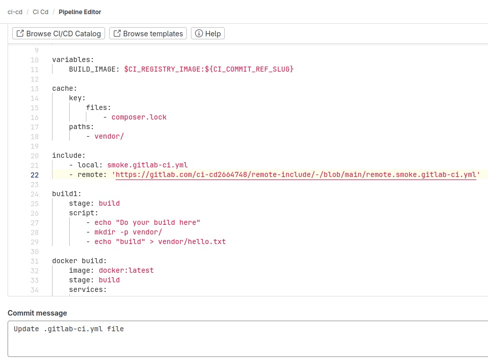

Создал файл с тестовой job в локальном репозитории. Создал новый проект и в нем файл с еще одной тестовой job.

Указал в pipeline первого проекта include.

Результат локальной тестовой job.

Результат удаленной тестовой job.

